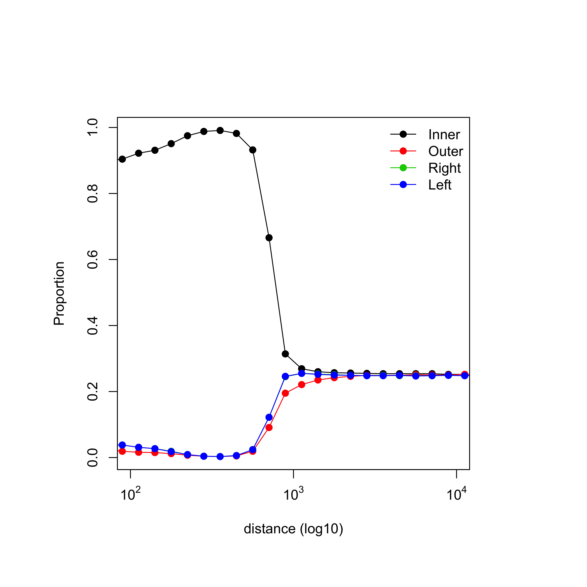
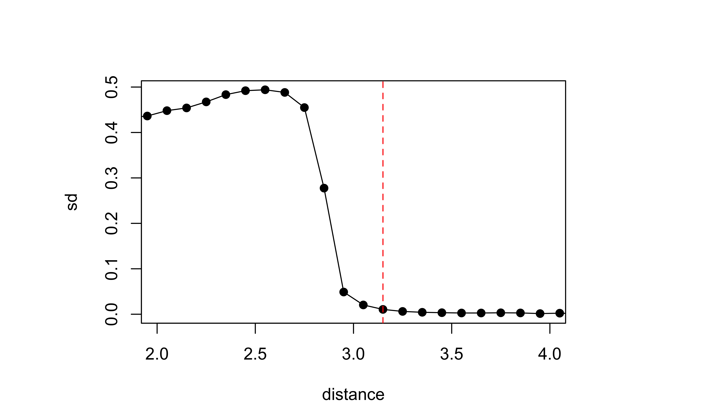
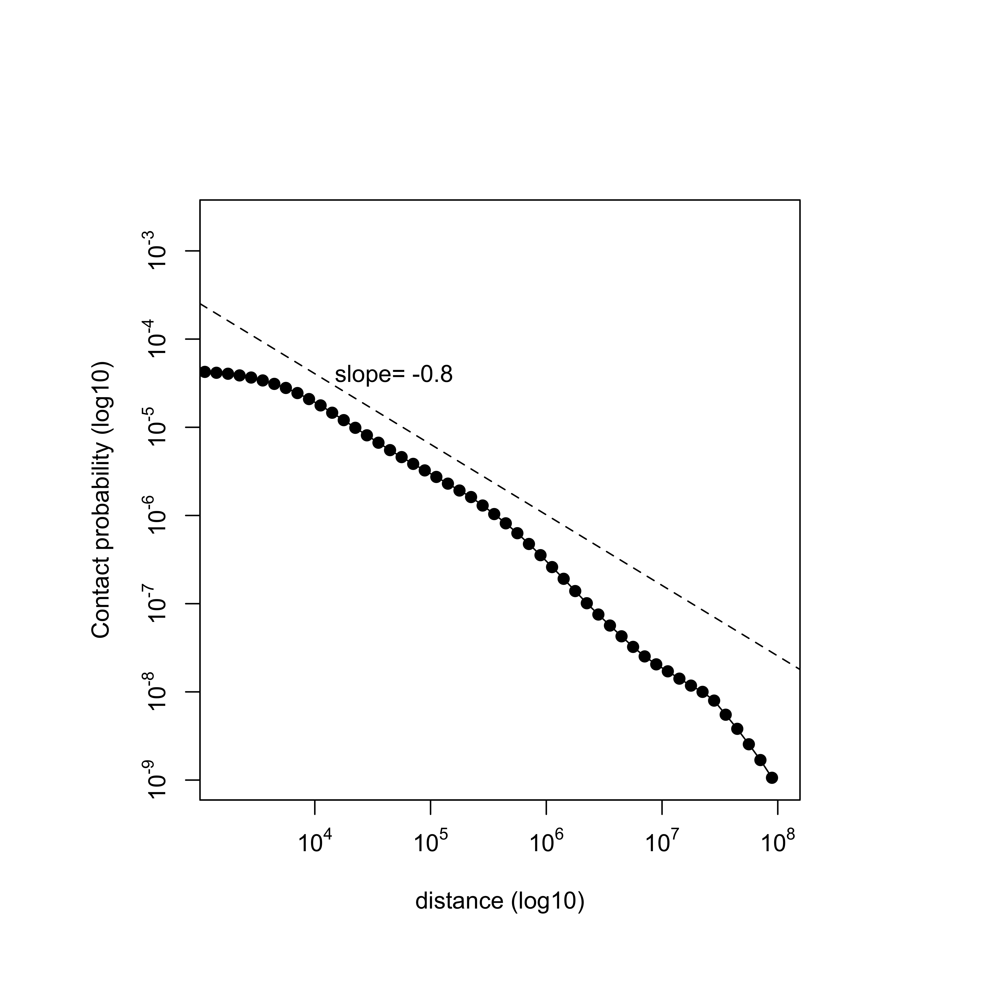

Pairsqc is a tool for generating a QC report for a Hi-C pairs file.


### Dependency
* Python >=2.7
* R
* devtools (R package)
```
R CMD Install devtools
```
* Nozzle
```
#Install Nozzle as follows, outside the pairsqc directory (avoid git clone inside another git repo)
git clone https://github.com/parklab/nozzle
cd nozzle
./install.sh
```

### usage
```
python pairsqc.py --pairs <input_pairsfile> --chrsize <input_chrsizefile>
Rscript plot.r
```

### Output
The python script generates two text output files, `report/cis_to_trans.out` and `report/plot_table.out`.
The R script generates image files in `report/plots`.
The output report can be found in `report/pairsqc_report.html`.
Output text file example : [cis_to_trans.out](report/cis_to_trans.out) [plot_table.out](report/plot_table.out)


### example run
```
python pairsqc.py --pairs ../pairix/samples/merged_nodup.tab.chrblock_sorted.txt.gz --chrsize ~/data/references/hg19.chrom.size
Rscript plot.r
```

&nbsp;
### QC metrics and plots
#### Cis-to-trans ratio
* Cis-to-trans ratio is computed as number_of_cis_reads / (number_of_cis_reads + number_of_trans_reads) * 100, where a cis read is defined as an intrachromosomal read whose 5'-5' separation is > T. A trans read is an interchromosomal read. T=20kb.
* Cis-to-trans ratio at T=5kb and T=20kb show only minor difference (less than 10%).

#### Proportion of read orientations versus genomic separation
* s = 5'-5' separation of an intrachromosomal read.
* s is binned at log10 scale at interval of 0.1 (growing by ~1.25-fold).
* For each bin, the number of reads with each of the four orientations is obtained. To compute proportion, each count is supplemented with a pseudocount of 1E-100, and divided by the sum over the four orientations for that bin.
* The first bin where the four orientations converge is called resolution, and is determined by using standard deviation of the proportions < 0.02.




#### Contact propability versus genomic separation
* s = 5'-5' separation of an intrachromosomal read.
* s is binned at log10 scale at interval of 0.1 (growing by ~1.25-fold).
* For each bin, contact probability is computed as number_of_reads / number_of_possible_reads / bin_size.
  * number_of_possible_reads is computed as the sum of L_chr - s_mid - 1 over all chromosomes included in the input `chrsize` file, where L_chr is the length of a chromosome. This is equivalent of L_genome - N_chr * (s_mid + 1), where L_genome is the sum of all chromosome lengths and N_chr is the number of chromosomes. S_mid is the mid point of the bin at log10 scale (bin 10^2.8 ~ 10^2.9 has mid point 10^2.85).
  * bin_size is computed as max distance - min distance (e.g. for bin 10^2.8 ~ 10^ 2.9, the binsize is 10^2.9 - 10^2.8).
* Slope of the region 10^4 ~ 10^5.5 is displayed.



#### Speed
2.7sec/M reads on Macbook Air with 2.2 GHz Intel Core i7.
(~2700 seconds for 1B reads)
