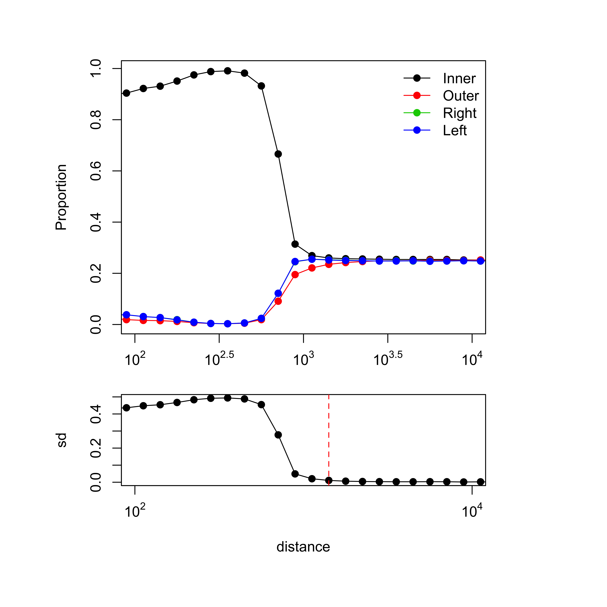
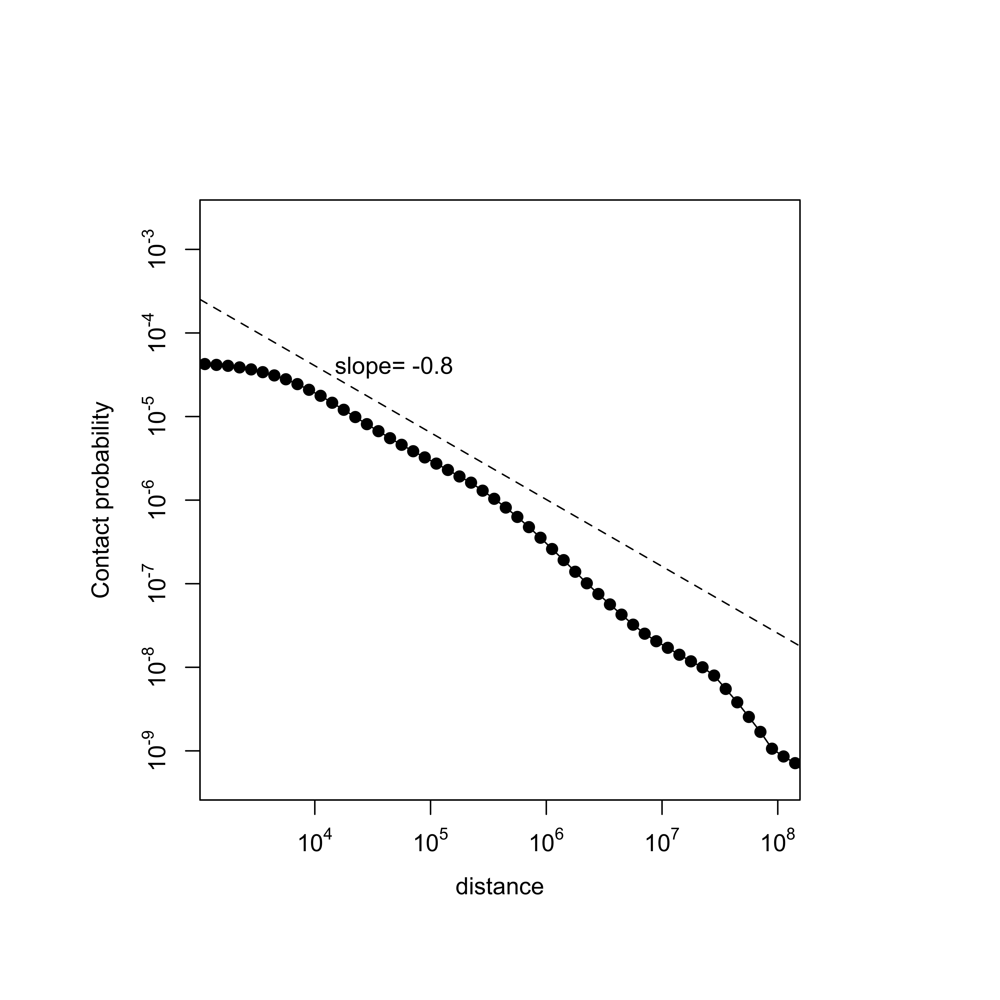
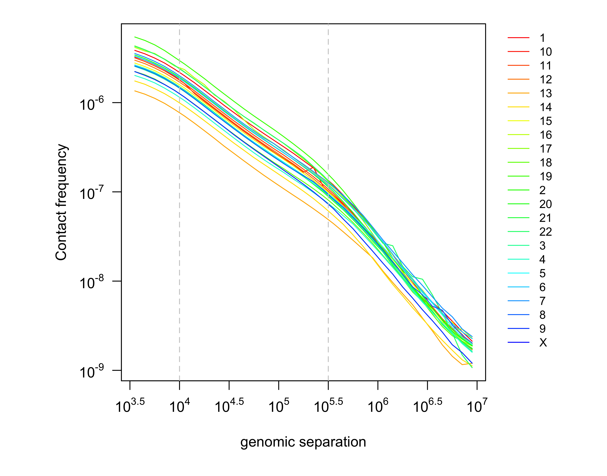

Pairsqc is a tool for generating a QC report for a Hi-C pairs file.


### Dependency
* Python >=2.7
* R
* Python packages
  * pypairix
  ```
  pip install pypairix
  ```
  
* R packages
  * devtools
  ```
  R CMD Install devtools
  ```
  * Nozzle
  ```r
  # open an R session and type in the following.
  install.packages( "Nozzle.R1", type="source" );
  ```
  If the above didn't work, try the following.
  ```
  # Install as follows, outside the pairsqc directory (avoid git clone inside another git repo)
  git clone https://github.com/parklab/nozzle
  cd nozzle
  ./install.sh
  ```
  
## Installation
```
# no need to install, just download
git clone https://github.com/4dn-dcic/pairsqc
```

### Usage
1) pairsqc.py
```
usage: pairsqc.py [-h] [-p PAIRS] [-c CHRSIZE] [-t INPUT_TYPE]
                  [-O OUTPUT_PREFIX]

QC for Pairs

optional arguments:
  -h, --help            show this help message and exit
  -p PAIRS, --pairs PAIRS
                        input pairs file
  -c CHRSIZE, --chrsize CHRSIZE
                        input chromsize file
  -t INPUT_TYPE, --input_type INPUT_TYPE
                        input file type (P:pairs, M:merged_nodups,
                        OM:old_merged_nodups)
  -O OUTPUT_PREFIX, --output_prefix OUTPUT_PREFIX
                        prefix of output directory (output directory name will
                        be <output_prefix>_report
```
2) plot.r
```
Rscript plot.r <enzyme_type> [<report_dir>]
# <enzyme_type> is either 4 (four-cutter, MboI, DpnII) or 6 (six-cutter, HindIII, NcoI). This value is used to draw a line for expected convergence point for read orientations.
# If <report_dir> is not specified, it assumed './report' as the report directory. The output directory of pairsqc.py must match <report_dir>, which is '<OUTPUT_PREFIX>_report'.
```

### Output
If output prefix is not specified, the output directory will be './report'
The python script generates two text output files, `report/cis_to_trans.out` and `report/plot_table.out`.
The R script generates image files in `report/plots`.
The output report can be found in `report/pairsqc_report.html`.
* Output text file example : [cis_to_trans.out](report/cis_to_trans.out) [plot_table.out](report/plot_table.out)
* Output report example : [report](report/pairsqc_report.html) : To see a rendered version, download `report.zip` (example 1) or `report2.zip` (example 2), uncompress, and open `report/pairsqc_report.html`.

### Example run
```
python pairsqc.py -p test_samples/merged_nodup.tab.chrblock_sorted.txt.gz -c test_samples/hg19.chrom.size -t M
Rscript plot.r 4
zip report.zip report # if you want to create a zip file for the report.
```

&nbsp;
### QC metrics and plots
#### Cis-to-trans ratio
* Cis-to-trans ratio is computed as number_of_cis_reads / (number_of_cis_reads + number_of_trans_reads) * 100, where a cis read is defined as an intrachromosomal read whose 5'-5' separation is > T. A trans read is an interchromosomal read. T=20kb.
* Cis-to-trans ratio at T=5kb and T=20kb show only minor difference (less than 10%).

#### Percent long-range intrachromosome reads
* This is number_of_long_cis_reads / total_reads, whereas a long_cis_read is defined as an intrachromosomal read whose 5'-5' separation is > T. T=20kb. This is identical to the 'cis_read' in the cis-to-trans ratio, since cis-to-trans ratio is computed using only long-range cis reads. Rao et al. suggests 15% is the minimal allowed value and 40% or higher suggests a good library.

#### Proportion of read orientations versus genomic separation
* s = 5'-5' separation of an intrachromosomal read.
* s is binned at log10 scale at interval of 0.1 (growing by ~1.25-fold).
* For each bin, the number of reads with each of the four orientations is obtained. To compute proportion, each count is supplemented with a pseudocount of 1E-100, and divided by the sum over the four orientations for that bin.
* The first bin where the four orientations converge is called resolution, and is determined by using standard deviation of the proportions < 0.005.
* The contact frequency vs genomic separation plot is similar to Proportion of read orientation versus genomic separation, except the actual read counts are displayed instead of proportions.




#### Contact propability versus genomic separation
* s = 5'-5' separation of an intrachromosomal read.
* s is binned at log10 scale at interval of 0.1 (growing by ~1.25-fold).
* For each bin, contact probability is computed as number_of_reads / number_of_possible_reads / bin_size.
  * number_of_possible_reads is computed as the sum of L_chr - s_mid - 1 over all chromosomes included in the input `chrsize` file, where L_chr is the length of a chromosome. This is equivalent of L_genome - N_chr * (s_mid + 1), where L_genome is the sum of all chromosome lengths and N_chr is the number of chromosomes. S_mid is the mid point of the bin at log10 scale (bin 10^2.8 ~ 10^2.9 has mid point 10^2.85).
  * bin_size is computed as max distance - min distance (e.g. for bin 10^2.8 ~ 10^ 2.9, the binsize is 10^2.9 - 10^2.8).
* Slope of the region 10^4 ~ 10^5.5 is displayed.



#### Contact propability versus genomic separation, per chromosome
* Same as Contact propability versus genomic separation, but for each chromosome



#### Speed
2.7sec/M reads on Macbook Air with 2.2 GHz Intel Core i7.
(~2700 seconds for 1B reads)
